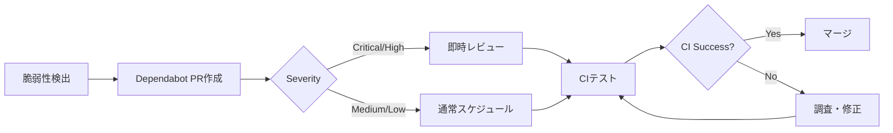

# Dependabot 設定ガイド

このドキュメントでは、RustCMSプロジェクトのDependabot設定について説明します。

## 📋 概要

Dependabotは以下の3つのエコシステムで依存関係を自動的に更新します：

1. **Cargo** - Rust依存関係（週次、月曜 09:00 JST）
2. **GitHub Actions** - ワークフロー内のアクション（週次、月曜 10:00 JST）
3. **Docker** - ベースイメージ（週次、月曜 11:00 JST）

## 🔧 設定内容

### 1. Cargo依存関係

```yaml
package-ecosystem: "cargo"
interval: "weekly"
open-pull-requests-limit: 10
```

**対象ファイル:**

- `Cargo.toml`
- `Cargo.lock`

**更新内容:**

- 直接依存関係のバージョン更新
- セキュリティアドバイザリの自動適用
- SemVerに準拠したバージョニング

**PRラベル:**

- `dependencies`
- `rust`

**コミットメッセージ:**

```
deps(cargo): bump tokio from 1.35.0 to 1.36.0

Bumps [tokio](https://github.com/tokio-rs/tokio) from 1.35.0 to 1.36.0.
...
```

### 2. GitHub Actions

```yaml
package-ecosystem: "github-actions"
interval: "weekly"
open-pull-requests-limit: 5
```

**対象ファイル:**

- `.github/workflows/*.yml`

**更新内容:**

- アクションのcommit SHA更新
- バージョンコメントの更新
- 新しいメジャーバージョンの通知

**PRラベル:**

- `dependencies`
- `ci`
- `github-actions`

**例:**

```yaml
# Before
uses: actions/checkout@b4ffde65f46336ab88eb53be808477a3936bae11 # v4.1.1

# After (Dependabot update)
uses: actions/checkout@a1b2c3d4e5f6a7b8c9d0e1f2a3b4c5d6e7f8a9b0 # v4.1.2
```

### 3. Docker

```yaml
package-ecosystem: "docker"
interval: "weekly"
open-pull-requests-limit: 3
```

**対象ファイル:**

- `Dockerfile`
- `Dockerfile.security`

**更新内容:**

- ベースイメージのタグ更新
- セキュリティパッチの適用
- Alpine/Debian等のOSアップデート

**PRラベル:**

- `dependencies`
- `docker`

**例:**

```dockerfile
# Before
FROM rust:1.75-alpine

# After (Dependabot update)
FROM rust:1.76-alpine
```

## 🎯 PRの処理フロー

### 自動承認の対象

以下の条件を満たすPRは自動的にマージされます（将来の実装）:

1. ✅ パッチバージョン更新（例: 1.2.3 → 1.2.4）
2. ✅ すべてのCIチェックが成功
3. ✅ セキュリティ脆弱性の修正
4. ✅ 後方互換性がある

### 手動レビューが必要なPR

以下の場合は手動レビューが必要です：

1. ⚠️ メジャーバージョン更新（例: 1.x.x → 2.0.0）
2. ⚠️ マイナーバージョン更新（例: 1.2.x → 1.3.0）
3. ⚠️ Breaking Changesを含む
4. ⚠️ CIが失敗する
5. ⚠️ Docker基盤イメージの変更

## 📊 Dependabot PRの統計

### 週次更新の予想

| エコシステム | 平均PR数/週 | マージ時間 |
|------------|-----------|----------|
| Cargo | 3-5 | 1-2時間 |
| GitHub Actions | 0-2 | 即時 |
| Docker | 0-1 | 1時間 |

### 月間の影響

```
月間PR数: 約15-30件
自動マージ: 60-70%
手動レビュー: 30-40%
セキュリティ修正: 1-3件
```

## 🔒 セキュリティ対応

### 脆弱性アラート

Dependabotは以下の場合に即座にPRを作成します：

1. **Critical脆弱性**: 即時PR作成
2. **High脆弱性**: 24時間以内にPR作成
3. **Medium脆弱性**: 通常スケジュール
4. **Low脆弱性**: 通常スケジュール

### セキュリティPRの識別

```yaml
# PRタイトルの例
security(cargo): bump tokio from 1.35.0 to 1.35.1

# PRボディに含まれる情報
🔒 Security advisory detected
GHSA-xxxx-yyyy-zzzz: [vulnerability description]
Severity: High
```

### 対応フロー



## 🛠️ PRの処理方法

### 1. Cargoの依存関係更新

```bash
# PRをローカルで確認
gh pr checkout 123

# 依存関係を確認
cargo tree | grep -i "updated-package"

# テストを実行
cargo test --all-features

# 問題なければマージ
gh pr review --approve
gh pr merge --squash --delete-branch
```

### 2. GitHub Actions更新

```bash
# ワークフローの変更を確認
gh pr diff 123

# commit SHAが正しいか検証
# 1. GitHubでリリースタグを確認
# 2. commit SHAとバージョンの対応を検証

# CIが成功していることを確認
gh pr checks 123

# マージ
gh pr merge --squash --delete-branch
```

### 3. Docker更新

```bash
# ローカルでビルドテスト
docker build -t rustcms:test .

# イメージサイズを確認
docker images rustcms:test

# Trivyスキャン
trivy image rustcms:test

# 問題なければマージ
gh pr merge --squash --delete-branch
```

## 🚫 無視設定

### 特定の依存関係を無視

一時的に更新を無視したい場合：

```bash
# コマンドライン
gh pr comment -b "@dependabot ignore this major version" 123
gh pr comment -b "@dependabot ignore this minor version" 123
gh pr comment -b "@dependabot ignore this dependency" 123

# または dependabot.yml に追加
ignore:
  - dependency-name: "problematic-crate"
    versions: ["2.x"]
```

### 一般的な無視ケース

```yaml
# 例: OpenSSL（システムレベルで管理）
ignore:
  - dependency-name: "openssl-sys"
    update-types: ["version-update:semver-major"]

# 例: Nightly-only機能を使用するクレート
ignore:
  - dependency-name: "nightly-crate"
    versions: ["*"]
```

## 📈 モニタリング

### Dependabotダッシュボード

GitHubのInsightsから確認：

```
Repository → Insights → Dependency graph → Dependabot
```

### メトリクス

```bash
# 未解決のDependabot PRを確認
gh pr list --label dependencies --state open

# 最近マージされたDependabot PR
gh pr list --label dependencies --state merged --limit 10

# セキュリティアラート
gh api /repos/:owner/:repo/vulnerability-alerts
```

### 週次レポート

```bash
# 自動レポート生成スクリプト
cat > scripts/dependabot-report.sh << 'EOF'
#!/bin/bash
set -euo pipefail

echo "=== Dependabot Weekly Report ==="
echo ""

# オープンなPR
OPEN=$(gh pr list --label dependencies --state open --json number,title,createdAt | jq length)
echo "Open PRs: ${OPEN}"

# 今週マージされたPR
MERGED=$(gh pr list --label dependencies --state merged --search "merged:>=$(date -d '7 days ago' +%Y-%m-%d)" --json number | jq length)
echo "Merged this week: ${MERGED}"

# セキュリティ修正
SECURITY=$(gh pr list --label dependencies,security --state merged --search "merged:>=$(date -d '7 days ago' +%Y-%m-%d)" --json number | jq length)
echo "Security fixes: ${SECURITY}"

echo ""
echo "=== Open PRs ==="
gh pr list --label dependencies --state open --json number,title,createdAt | \
  jq -r '.[] | "PR #\(.number): \(.title) (created: \(.createdAt[:10]))"'
EOF

chmod +x scripts/dependabot-report.sh
```

## 🤖 自動化設定（将来）

### GitHub Actions for Dependabot

```yaml
# .github/workflows/dependabot-auto-merge.yml
name: Dependabot Auto-merge

on:
  pull_request_target:
    types: [opened, synchronize]

permissions:
  contents: write
  pull-requests: write

jobs:
  auto-merge:
    runs-on: ubuntu-latest
    if: github.actor == 'dependabot[bot]'
    steps:
      - name: Dependabot metadata
        id: metadata
        uses: dependabot/fetch-metadata@v1
        with:
          github-token: "${{ secrets.GITHUB_TOKEN }}"

      - name: Auto-merge patch updates
        if: |
          steps.metadata.outputs.update-type == 'version-update:semver-patch' &&
          steps.metadata.outputs.package-ecosystem == 'cargo'
        run: gh pr merge --auto --squash "$PR_URL"
        env:
          PR_URL: ${{ github.event.pull_request.html_url }}
          GITHUB_TOKEN: ${{ secrets.GITHUB_TOKEN }}

      - name: Auto-approve GitHub Actions updates
        if: steps.metadata.outputs.package-ecosystem == 'github-actions'
        run: gh pr review --approve "$PR_URL"
        env:
          PR_URL: ${{ github.event.pull_request.html_url }}
          GITHUB_TOKEN: ${{ secrets.GITHUB_TOKEN }}
```

## 🔧 トラブルシューティング

### 問題1: Dependabotが動作しない

**診断:**

```bash
# dependabot.ymlの構文チェック
yamllint .github/dependabot.yml

# Dependabotの設定を確認
gh api /repos/:owner/:repo/dependabot/secrets
```

**解決策:**

- リポジトリの設定で「Dependabot version updates」が有効か確認
- `dependabot.yml`の構文エラーを修正
- プライベートリポジトリの場合はトークンを設定

### 問題2: PRが作成されすぎる

**診断:**

```bash
# 現在のオープンPR数
gh pr list --label dependencies --state open | wc -l
```

**解決策:**

```yaml
# open-pull-requests-limitを調整
open-pull-requests-limit: 5  # デフォルトより少なく
```

### 問題3: PRのCIが失敗する

**診断:**

```bash
# 失敗したジョブを確認
gh pr checks 123 --watch

# ローカルでテスト
gh pr checkout 123
cargo test --all-features
```

**解決策:**

- Breaking Changesがある場合はコードを修正
- テストを更新
- 問題が解決しない場合は一時的に無視

### 問題4: マージコンフリクト

**診断:**

```bash
# コンフリクトを確認
gh pr view 123 --json mergeable

# ベースブランチとの差分
gh pr diff 123
```

**解決策:**

```bash
# DependabotにリベースさせるPRコメント
gh pr comment 123 --body "@dependabot rebase"

# または手動でリベース
gh pr checkout 123
git rebase main
git push --force
```

## 📚 ベストプラクティス

### 1. 定期的なレビュー

```bash
# 毎週月曜日にDependabot PRをレビュー
# チームカレンダーに設定推奨
```

### 2. バッチマージ

```bash
# 複数のパッチ更新を一度にマージ
for pr in $(gh pr list --label dependencies,rust --json number -q '.[].number'); do
  gh pr merge --squash "$pr"
done
```

### 3. セキュリティ優先

```
1. Critical/High脆弱性 → 即座に対応
2. パッチバージョン → 当日中
3. マイナーバージョン → 1週間以内
4. メジャーバージョン → 計画的に
```

### 4. CI統合

```yaml
# すべてのDependabot PRでフルテストを実行
# ci.ymlでbranches設定を調整
on:
  pull_request:
    branches: [main, "dependabot/**"]
```

## 🎓 参考リソース

- [Dependabot公式ドキュメント](https://docs.github.com/en/code-security/dependabot)
- [設定オプション一覧](https://docs.github.com/en/code-security/dependabot/dependabot-version-updates/configuration-options-for-the-dependabot.yml-file)
- [Dependabot Changelog](https://github.blog/changelog/label/dependabot/)
- [Security Advisories](https://github.com/advisories)

---

**最終更新:** 2025-10-04
**メンテナー:** @jungamer-64
**レビュアー:** DevOps Team
