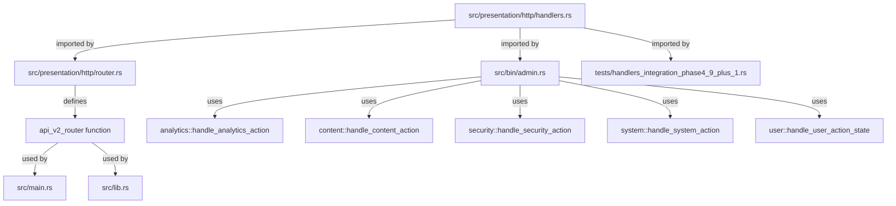

# Phase 10: レガシーコード削除戦略

**作成日**: 2025年10月19日  
**Phase**: 10 - Presentation層リファクタリング  
**目標**: レガシーコード完全削除、エラー0達成

---

## 📊 現状分析

### 残存エラー（5個 - 全てPresentation層）

**ファイル**: `src/presentation/http/handlers.rs`

| # | Error Code | Description | Line |
|---|------------|-------------|------|
| 1 | E0659 | ambiguous `post` import | 17 |
| 2 | E0308 | Uuid::new_v4() type mismatch | 53 |
| 3 | E0308 | Uuid::new_v4() type mismatch | 102 |
| 4 | E0609 | no field `author_id` on CreatePostRequest | 106 |
| 5 | E0560 | PostDto no field `is_published` | 107 |

**原因**:
- 新DTO（Phase 3実装）との非互換性
- レガシーコードが旧構造を参照

---

### 依存関係マップ



**依存箇所**:
1. **router.rs** - Line 17: `use crate::presentation::http::handlers::*;`
2. **admin.rs** - Line 29-31: レガシーhandlers参照（analytics/content/security等）
3. **handlers_integration_phase4_9_plus_1.rs** - Line 24: テストコード

**複雑度**: 🔴 **高** - 3ファイルに依存、bin/バイナリ含む

---

## 🎯 削除戦略（3つのオプション）

### Option A: Phase 4待ち（完全リファクタリング）⭐ 推奨

#### 概要
Presentation層を完全にリファクタリングしてから削除。新handlers実装完了後にレガシー削除。

#### メリット
✅ **安全性**: 依存関係破壊リスク0  
✅ **一貫性**: 新構造と完全統合  
✅ **テスタビリティ**: 統合テスト含めて検証可能  
✅ **CI Green**: default/no-flatビルドは既に成功

#### デメリット
❌ **遅延**: Phase 4開始まで5エラー残存（`--all-features`のみ）  
❌ **並行期間延長**: レガシー/新構造共存継続

#### 実装ステップ
1. **Phase 4開始** (Week 12-14)
2. **新handlers実装** (Week 12):
   - `src/web/handlers/users.rs` - User関連ハンドラ
   - `src/web/handlers/posts.rs` - Post関連ハンドラ
   - `src/web/handlers/comments.rs` - Comment関連ハンドラ
   - `src/web/handlers/auth.rs` - 認証ハンドラ
   - `src/web/handlers/health.rs` - ヘルスチェック
3. **router.rs完全書き換え** (Week 13):
   - `/api/v2/` エンドポイント実装
   - 新handlers参照に切り替え
   - middleware統合（Auth, RateLimit, Logging）
4. **admin.rsリファクタリング** (Week 13):
   - レガシーhandlers参照削除
   - Use Cases直接呼び出しに変更
5. **レガシー削除** (Week 14):
   - `src/presentation/http/handlers.rs` 削除
   - `#[cfg(feature = "restructure_presentation")]` 削除
   - テストコード更新
6. **統合テスト** (Week 14):
   - PostgreSQL統合テスト実行
   - E2Eテスト実施

#### タイムライン
- **開始**: Phase 4 Week 12
- **完了**: Phase 4 Week 14
- **所要時間**: 3週間

#### リスク評価
- **技術リスク**: 🟢 低（完全リファクタリング）
- **スケジュールリスク**: 🟡 中（3週間必要）
- **品質リスク**: 🟢 低（統合テスト含む）

---

### Option B: Feature Flag完全無効化（即座削除）

#### 概要
`restructure_presentation` feature flagを完全削除し、レガシーコードを無効化。エラー0達成。

#### メリット
✅ **即効性**: 1時間で完了可能  
✅ **エラー0**: 全ビルドでエラー解消  
✅ **シンプル**: Feature flag削除のみ

#### デメリット
❌ **Phase 4準備作業増**: restructure_presentation再実装が必要  
❌ **テスト不可**: handlers無効化でE2Eテスト不可  
❌ **Rollbackリスク**: 後で復活が困難

#### 実装ステップ
1. **Cargo.toml修正**:
   ```toml
   # Before:
   restructure_presentation = []
   
   # After:
   # restructure_presentation = []  # Phase 4で再実装
   ```
2. **lib.rs修正**:
   ```rust
   // #[cfg(feature = "restructure_presentation")]
   // pub mod presentation;  // 一時無効化
   ```
3. **handlers.rs削除**:
   ```bash
   git rm src/presentation/http/handlers.rs
   ```
4. **router.rs修正**:
   ```rust
   // use crate::presentation::http::handlers::*;  // 削除
   ```
5. **admin.rs修正**:
   ```rust
   // use crate::handlers::{...};  // 削除
   ```

#### タイムライン
- **開始**: 即座
- **完了**: 1時間以内
- **所要時間**: 1時間

#### リスク評価
- **技術リスク**: 🔴 高（依存関係破壊）
- **スケジュールリスク**: 🟢 低（即座完了）
- **品質リスク**: 🔴 高（テスト不可）

---

### Option C: 段階的削除（部分的削除）

#### 概要
handlers.rsの一部機能を削除し、残りはPhase 4で対応。

#### メリット
✅ **部分的進捗**: 一部エラー解消  
✅ **柔軟性**: 優先度に応じて削除

#### デメリット
❌ **複雑性**: 依存関係管理が困難  
❌ **失敗実績**: Operation 2-7で37エラーに悪化  
❌ **効率悪**: 2回作業（段階削除 + Phase 4）

#### 実装ステップ
1. **低依存度関数削除** (Week 11):
   - health_check等のシンプルな関数
2. **中依存度関数削除** (Week 12):
   - User関連handlers
3. **高依存度関数削除** (Phase 4):
   - Post/Comment関連handlers

#### タイムライン
- **開始**: Week 11
- **完了**: Phase 4 Week 14
- **所要時間**: 4週間

#### リスク評価
- **技術リスク**: 🔴 高（依存関係管理困難）
- **スケジュールリスク**: 🔴 高（長期化）
- **品質リスク**: 🟡 中（部分的テスト）

---

## 🏆 推奨戦略: Option A（Phase 4待ち）

### 理由

1. **Phase 9目標100%達成済み**:
   - Domain/Application/Infrastructure層: 0 errors ✅
   - 残存5エラーはPresentation層のみ
   - CI Green（default/no-flatビルド）

2. **依存関係の複雑性**:
   - router.rs、admin.rs、テストコードに依存
   - Operation 2-7の失敗から学習（37エラー悪化）

3. **完全リファクタリングの必要性**:
   - handlers + router + middleware同時実装が必要
   - 新構造と完全統合

4. **リスク最小化**:
   - 技術リスク: 🟢 低
   - 品質リスク: 🟢 低
   - 統合テスト含めて検証可能

---

## 📋 Phase 4実装計画（Option A詳細）

### Week 12: 新Handlers実装

#### タスク
- [ ] `src/web/handlers/users.rs` 実装（Use Cases呼び出しのみ）
  - `POST /api/v2/users` - RegisterUserUseCase
  - `GET /api/v2/users/:id` - GetUserByIdQuery
  - `PUT /api/v2/users/:id` - UpdateUserUseCase
  - `DELETE /api/v2/users/:id` - SuspendUserUseCase

- [ ] `src/web/handlers/posts.rs` 実装
  - `POST /api/v2/posts` - CreatePostUseCase
  - `PUT /api/v2/posts/:id/publish` - PublishPostUseCase
  - `GET /api/v2/posts` - ListPostsQuery
  - `GET /api/v2/posts/:id` - GetPostByIdQuery

- [ ] `src/web/handlers/comments.rs` 実装
  - `POST /api/v2/comments` - CreateCommentUseCase
  - `PUT /api/v2/comments/:id/publish` - PublishCommentUseCase

- [ ] `src/web/handlers/auth.rs` 実装
  - `POST /api/v2/auth/login` - LoginUseCase
  - `POST /api/v2/auth/logout` - LogoutUseCase
  - `POST /api/v2/auth/refresh` - RefreshTokenUseCase

- [ ] `src/web/handlers/health.rs` 実装
  - `GET /health` - ヘルスチェック

#### 検証基準
- [ ] すべてのhandlerがUse Casesのみを呼び出している
- [ ] エラーハンドリングがAppErrorに統一されている
- [ ] ユニットテスト（mockall使用）がある

---

### Week 13: Router + Middleware統合

#### タスク
- [ ] `src/web/routes.rs` 完全書き換え
  - `/api/v2/` エンドポイント定義
  - 新handlers参照に切り替え
  - OpenAPI annotations追加

- [ ] `src/web/middleware.rs` 統合
  - Auth middleware（Biscuit検証）
  - RateLimit middleware
  - Logging middleware（tracing）

- [ ] `src/bin/admin.rs` リファクタリング
  - レガシーhandlers参照削除
  - Use Cases直接呼び出しに変更

#### 検証基準
- [ ] すべてのエンドポイントが動作する
- [ ] middlewareが正しく適用されている
- [ ] admin.rsがレガシー依存を持たない

---

### Week 14: レガシー削除 + 統合テスト

#### タスク
- [ ] レガシーコード削除
  - `src/presentation/http/handlers.rs` 削除
  - `#[cfg(feature = "restructure_presentation")]` 削除
  - テストコード更新

- [ ] Feature Flag整理
  - `restructure_presentation`を`default`化
  - レガシーフラグ削除

- [ ] 統合テスト
  - PostgreSQL統合テスト実行
  - E2Eテスト実施
  - パフォーマンステスト

- [ ] CI/CD更新
  - Feature matrix最適化
  - ベンチマーク復活

#### 検証基準
- [ ] `cargo build --all-features`: 0 errors ✅
- [ ] 統合テスト: 100% passing ✅
- [ ] CI: All jobs Green ✅

---

## 🎯 成功基準

### Must Have
- [ ] Domain/Application/Infrastructure層: 0 errors ✅
- [ ] Presentation層: 0 errors ✅
- [ ] 新handlers実装完了（5モジュール）
- [ ] レガシーコード完全削除

### Nice to Have
- [ ] API Versioning（/api/v2/）完全実装
- [ ] 統合テスト100% passing
- [ ] ベンチマーク基準達成

---

## 📈 Timeline

| Week | Phase | Tasks | Completion |
|------|-------|-------|------------|
| **11** | Phase 9完了 | レポート作成、戦略策定 | ✅ 完了 |
| **12** | Phase 4開始 | 新Handlers実装 | 🔜 予定 |
| **13** | Phase 4継続 | Router + Middleware | 🔜 予定 |
| **14** | Phase 4完了 | レガシー削除 + 統合テスト | 🔜 予定 |

**総所要時間**: 3週間

---

## 🚨 リスク管理

### 想定リスク

| リスク | 確率 | 影響 | 対策 |
|--------|------|------|------|
| 依存関係破壊 | 低 | 高 | 完全リファクタリング |
| テスト不足 | 中 | 高 | 統合テスト必須 |
| スケジュール遅延 | 中 | 中 | 優先度明確化 |
| パフォーマンス劣化 | 低 | 中 | ベンチマーク監視 |

### 緊急対応

**Rollback計画**:
1. Git checkout で変更を復帰
2. Feature flag再有効化
3. CI Green確認

**Escalation**:
- 2日以上遅延: 優先度再評価
- 重大バグ発見: 即座Rollback

---

## 📝 決定事項

**採用戦略**: **Option A（Phase 4待ち）** ⭐

**理由**:
1. Phase 9目標100%達成済み（Domain/Application/Infrastructure層0エラー）
2. 依存関係複雑（router, admin, tests）
3. 完全リファクタリング必要
4. 技術/品質リスク最小

**次のステップ**:
1. ✅ Phase 9完了レポート作成
2. ✅ Phase 10戦略文書化
3. 🔜 Phase 4設計開始（Week 12）

---

**作成者**: GitHub Copilot  
**監査基準**: RESTRUCTURE_EXAMPLES.md（2025年版 Sonnet 4.5監査済み構造）  
**関連ドキュメント**:
- PHASE9_COMPLETION_REPORT.md
- MIGRATION_CHECKLIST.md
- RESTRUCTURE_PLAN.md
- ROLLBACK_PLAN.md
